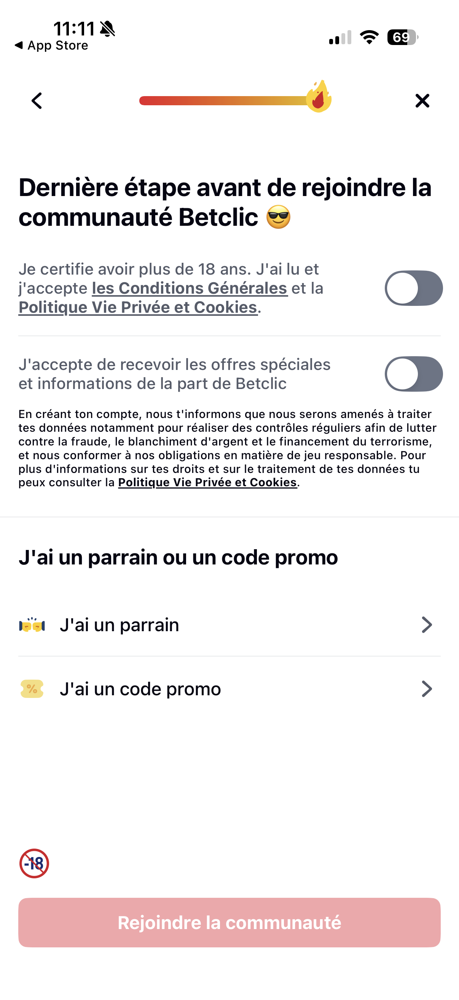
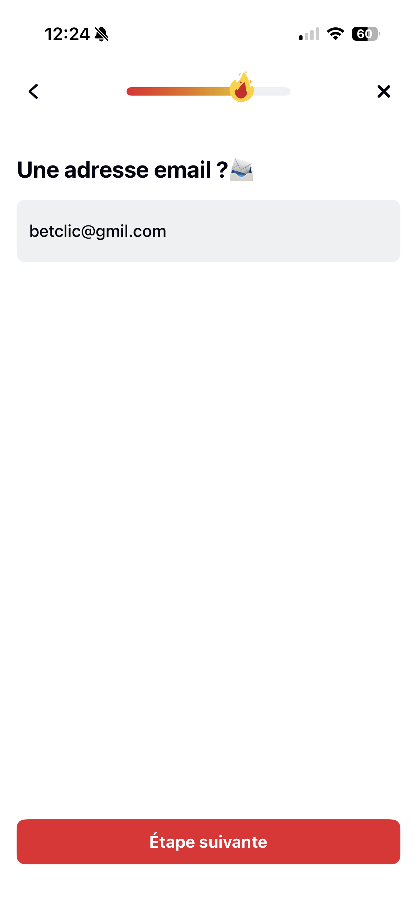
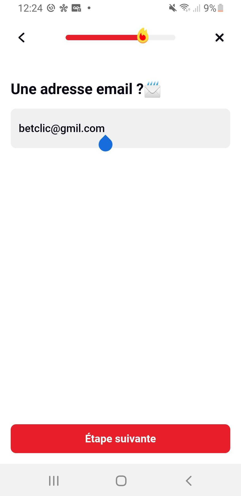
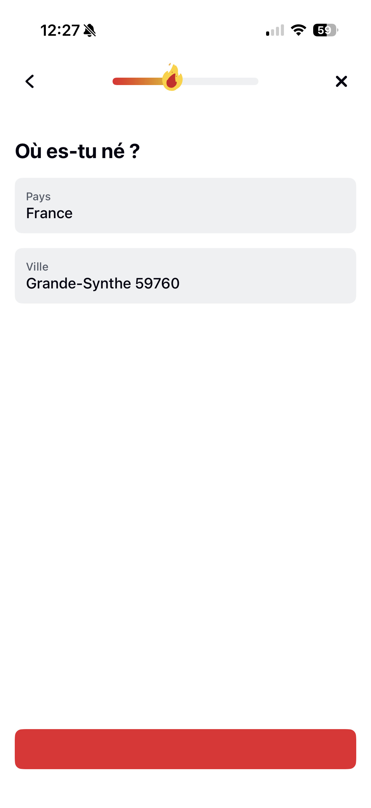
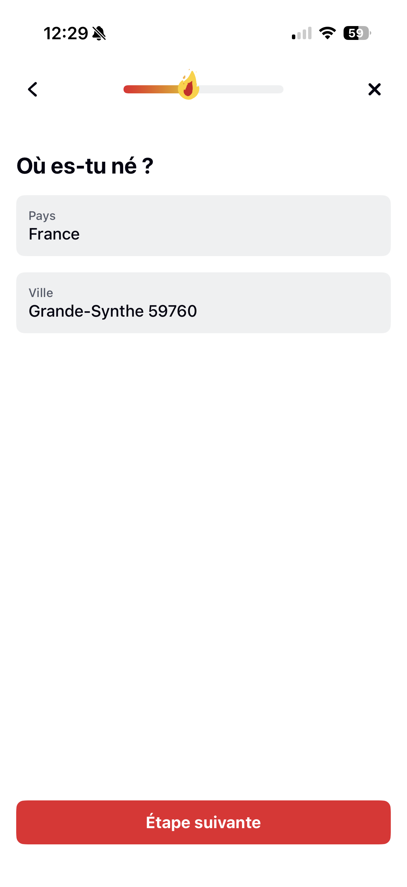
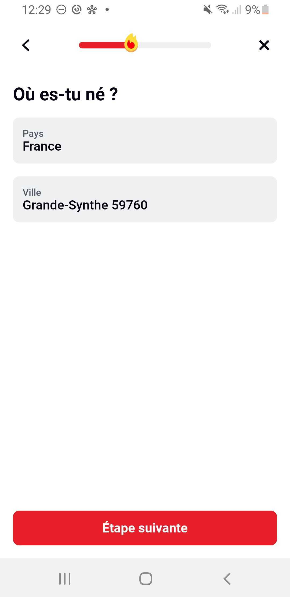

# Betclic – QA Assessment

## Part 1: Flow Analysis & UI Review

---

# 1. Environment

| Device            | OS         | App Version    |
| ----------------- | ---------- | -------------- |
| iPhone 16 Pro     | iOS 26.3   | Betclic 9.10.1 |
| Samsung Galaxy S9 | Android 10 | Betclic 9.10.1 |

- **Scope:** Account registration / onboarding flow (app launch → referral code step)
- **Primary test device:** Both devices — happy path verified on iOS and Android
- **Test limitations:** National ID upload and address verification intentionally skipped as instructed

---

# 2. Flow Map (Happy Path)

```
App Launch
→ Cookie Consent
→ iOS Tracking Permission (system-level)
→ Start Registration
→ Title Selection
→ First Name
→ Last Name
→ Date of Birth
→ Place of Birth (Country + City)
→ ID Document (Skipped)
→ Username
→ Password
→ Email
→ Phone Number
→ Address (Autocomplete + Confirmation)
→ Address Verification (Skipped)
→ Final Compliance Step (Age + T&C + Marketing + Referral Code)
```

---

# 3. Main Happy Path Description

### Step 1 – App Launch

User opens the Betclic mobile application and lands on the splash screen.

### Step 2 – Cookie Consent

A cookie consent modal is displayed with three options:

- Configure
- Accept all
- Continue without accepting

The user selects an option and proceeds.

### Step 2bis – iOS Tracking Permission (iOS Only)

An iOS App Tracking Transparency (ATT) system popup appears.  
This is an OS-level permission request, not part of Betclic’s UI.

The user can:

- Allow tracking
- Ask the app not to track

Regardless of the selection, the registration flow continues.

### Step 3 – Start Registration

User initiates the account creation process.

### Step 4 – Title Selection

User selects a civil status (e.g., Monsieur).

### Step 5 – First Name

User enters first name (as per official ID).

### Step 6 – Last Name

User enters last name.

### Step 7 – Date of Birth

User enters a valid birth date (18+).

### Step 8 – Place of Birth

User selects:

- Country of birth
- City (autocomplete field)

### Step 9 – ID Document

User is prompted to upload an identity document.  
As instructed, this step is skipped using “Do it later”.

### Step 10 – Username

User chooses an available username.

### Step 11 – Password

User enters a password meeting validation rules:

- At least 1 lowercase letter
- At least 1 uppercase letter
- At least 1 number
- Between 8 and 20 characters

Real-time validation feedback is displayed.

### Step 12 – Email

User enters a valid email address.

### Step 13 – Phone Number

User enters a valid mobile phone number.

### Step 14 – Address

User enters a street address.  
Autocomplete suggestions appear.  
User selects a valid address.

### Step 15 – Address Verification

User is prompted to:

- Upload proof of address  
  OR
- Receive a postal verification code

This step is skipped as instructed.

### Step 16 – Final Compliance & Referral Screen

User must:

- Certify being over 18 years old
- Accept Terms & Conditions

Optional:

- Accept marketing communications
- Enter referral / promo code

The account creation button becomes enabled once mandatory toggles are activated.

---

# 4. Alternative Branches Identified

## Alternative Branch 1 – Under 18 Date of Birth (Compliance Critical Path)

**What was tested:** Date of birth validation and legal age gating.

**How to reproduce (based on executed test):**

1. Start the registration flow.
2. Complete First Name and Last Name steps with valid data.
3. On the "Date of Birth" screen, enter a DOB that makes the user under 18 (e.g., `13/02/2008`).

**Actual result:**

- The date field is highlighted in red.
- A blocking error message is displayed stating that the user must wait until 18 years old to bet.
- Additional compliance warning indicates that providing false information or using a third party's identity may lead to account closure and funds being blocked.
- "Étape suivante" (Next step) button remains disabled.

**Evidence (Screenshots):**

| iOS                                                                            | Android                                                                                |
| ------------------------------------------------------------------------------ | -------------------------------------------------------------------------------------- |
|  |  |

**Expected result:**

- User must be strictly blocked from proceeding if under 18.
- Error messaging must be clear, legally compliant, and unambiguous.
- The blocking behavior must be consistent across devices and time zones.

**Boundary testing recommended (critical in gambling context):**

- Exactly 18 years old today → should be allowed.
- 18 years old minus 1 day → should be blocked.
- Clearly underage (e.g., 17 years old) → blocked.
- Senior age (e.g., 70+ years old) → allowed.
- Invalid dates (e.g., `31/02/2000`, `00/00/2000`, alphabetic input) → blocked with proper validation feedback.

---

**Boundary Test Results:**

| Test case                          | Expected                                                 | iOS Result                                                       | Android Result                                                           | Status |
| ---------------------------------- | -------------------------------------------------------- | ---------------------------------------------------------------- | ------------------------------------------------------------------------ | ------ |
| Under 18 (e.g., 13/02/2008)        | Block user + show regulatory message + disable next step | Blocked with red field + compliance warning + next step disabled | Blocked with same behavior — red field, compliance warning, CTA disabled | ✅ OK  |
| Exactly 18 years old today         | Allow user to proceed                                    | Allowed to proceed                                               | Allowed to proceed — same as iOS                                         | ✅ OK  |
| 18 years old minus 1 day           | Block user                                               | Blocked correctly                                                | Blocked correctly — same as iOS                                          | ✅ OK  |
| Senior age (70–120 years old)      | Allow user to proceed                                    | Allowed to proceed (tested up to 120 years old)                  | Allowed to proceed (tested up to 120 years old)                          | ✅ OK  |
| Invalid format (non-numeric input) | Block user with format validation                        | Only numeric input allowed (iOS keyboard restriction)            | Only numeric keyboard displayed — non-numeric input prevented            | ✅ OK  |
| 29/02 valid leap year              | Allow user to proceed                                    | Accepted on valid leap year                                      | Accepted on valid leap year — same as iOS                                | ✅ OK  |
| 29/02 non-leap year                | Block user                                               | Correctly blocked                                                | Correctly blocked — same as iOS                                          | ✅ OK  |

---

**QA Perspective:**
Age validation is a compliance-critical control in a regulated gambling environment. The age boundary logic must be precise (no off-by-one errors), robust against manual input manipulation, and aligned with legal requirements.

---

## Alternative Branch 2 – Invalid Password (Security & Validation Path)

**What was tested:** Password field validation rules and real-time feedback behavior.

**How to reproduce (based on executed test):**

1. Start the registration flow and proceed to the "Password" screen.
2. Enter passwords that violate one or more of the validation rules:
   - At least 1 lowercase letter
   - At least 1 uppercase letter
   - At least 1 number
   - Between 8 and 20 characters

**Actual result:**

- Real-time validation checklist is displayed below the password field.
- Each rule is visually updated as the user types (valid = green check, invalid = red/grey).
- The "Étape suivante" (Next step) button remains disabled until all rules are satisfied.
- No submission is possible with an invalid password.

**Evidence (Screenshots):**

| iOS                                                                                  | Android                                                                                      |
| ------------------------------------------------------------------------------------ | -------------------------------------------------------------------------------------------- |
|  |  |

> **Note:** iOS security policy hides password field content in screenshots. The password input is not visible in the iOS screenshot, but the validation checklist feedback is still visible and was verified during manual testing.

**Expected result:**

- User must not be able to proceed with a password that fails any validation rule.
- Real-time feedback must clearly indicate which rules are met and which are not.
- The CTA button must remain disabled until all criteria are satisfied.

**Validation rules tested:**

- At least 1 lowercase letter
- At least 1 uppercase letter
- At least 1 number
- Between 8 and 20 characters

---

**Boundary Test Results:**

| Test case                                  | Expected                                       | iOS Result                                                                                    | Android Result                 | Status |
| ------------------------------------------ | ---------------------------------------------- | --------------------------------------------------------------------------------------------- | ------------------------------ | ------ |
| Only lowercase (e.g., `abcdefgh`)          | Block — missing uppercase + number             | Blocked — 2 rules marked invalid, CTA disabled                                                | Blocked — same behavior as iOS | ✅ OK  |
| Only uppercase (e.g., `ABCDEFGH`)          | Block — missing lowercase + number             | Blocked — 2 rules marked invalid, CTA disabled                                                | Blocked — same behavior as iOS | ✅ OK  |
| Only numbers (e.g., `12345678`)            | Block — missing lowercase + uppercase          | Blocked — 2 rules marked invalid, CTA disabled                                                | Blocked — same behavior as iOS | ✅ OK  |
| 7 characters (e.g., `Abcde1!`)             | Block — too short                              | Blocked — length rule marked invalid, CTA disabled                                            | Blocked — same behavior as iOS | ✅ OK  |
| 8 characters valid (e.g., `Abcdef1!`)      | Allow — meets all rules                        | Allowed — all rules green, CTA enabled                                                        | Allowed — same behavior as iOS | ✅ OK  |
| 20 characters valid                        | Allow — meets all rules                        | Allowed — all rules green, CTA enabled                                                        | Allowed — same behavior as iOS | ✅ OK  |
| 21 characters                              | Block — too long                               | Blocked — length rule marked invalid, CTA disabled                                            | Blocked — same behavior as iOS | ✅ OK  |
| Special characters only (e.g., `!@#$%^&*`) | Block — missing lowercase + uppercase + number | Blocked — 3 rules marked invalid, CTA disabled                                                | Blocked — same behavior as iOS | ✅ OK  |
| Valid password (e.g., `Test1234`)          | Allow — meets all rules                        | Allowed — all rules green, CTA enabled                                                        | Allowed — same behavior as iOS | ✅ OK  |
| Empty field                                | Block — all rules invalid                      | Blocked — all rules marked invalid, CTA disabled                                              | Blocked — same behavior as iOS | ✅ OK  |
| Password matches username                  | Block — password must differ from username     | Blocked — error displayed: "Ton mot de passe doit être différent de ton pseudo", CTA disabled | Blocked — same behavior as iOS | ✅ OK  |

> **Note:** When the password matches the username, the entire validation checklist disappears and is replaced by a single error message: "Ton mot de passe doit être différent de ton pseudo". The standard rules (lowercase, uppercase, number, length) are no longer visible. This means the user loses all feedback on the other validation criteria while this error is active.

---

**⚠️ Security Observation — Password persisted locally after app kill:**
During testing, it was observed that all registration data — including the password — is persisted locally when the app is killed mid-registration. Upon reopening the app, the password field is pre-filled and can be revealed in clear text via the visibility toggle (eye icon). While the account does not yet exist, this exposes the user's password pattern (generic passwords, prefix-based construction) to anyone with physical access to the device. This could help compromise the user's other accounts. **Sensitive fields like passwords should be cleared on app termination or session expiry**, even if other form fields are retained for convenience. Severity: **High**.

**UX Observation — No password confirmation field:**
The registration flow does not include a password confirmation field. On mobile, typos are common due to smaller keyboards and autocorrect behavior. A user who mistypes their password during registration will only discover the error at their next login attempt, forcing them through a password reset flow. Adding a confirmation field would prevent this friction at minimal cost.

**QA Perspective:**
Password validation is a core security control. Real-time feedback improves UX by guiding the user, but the enforcement must be strict — no bypass should be possible regardless of input method. Note: the app does not appear to enforce special character requirements or check against common/breached passwords, which could be a security improvement opportunity. Additionally, when the password matches the username, the validation checklist is entirely replaced by a single error message — the user loses visibility on all other password rules, which is a UX inconsistency.

---

## Alternative Branch 3 – Mandatory Compliance Toggle Not Activated

**What was tested:** Final registration screen behavior when the mandatory compliance toggle is not activated.

**How to reproduce (based on executed test):**

1. Complete all registration steps up to the final compliance screen ("Dernière étape avant de rejoindre la communauté Betclic").
2. Leave the mandatory toggle deactivated:
   - "Je certifie avoir plus de 18 ans. J'ai lu et j'accepte les Conditions Générales et la Politique Vie Privée et Cookies."
     (I certify I am over 18. I have read and accept the Terms & Conditions and the Privacy & Cookie Policy.)
3. Attempt to submit the registration via "Rejoindre la communauté" (Join the community).

**Actual result:**

- The "Rejoindre la communauté" button remains disabled (faded) when the mandatory toggle is off.
- The user cannot submit the form without activating the mandatory toggle.
- The second toggle — marketing communications ("J'accepte de recevoir les offres spéciales et informations de la part de Betclic") — is optional and does not affect the button state.
- Referral / promo code section is also optional.

**Evidence (Screenshots):**

| iOS                                                                                      | Android                                                                                          |
| ---------------------------------------------------------------------------------------- | ------------------------------------------------------------------------------------------------ |
|  |  |

**Expected result:**

- The account creation button must remain disabled until the mandatory compliance toggle is activated.
- Optional toggle (marketing) must not be required to proceed.
- The distinction between mandatory and optional toggles must be clear to the user.

---

**Test Results:**

| Test case                                  | Expected                      | iOS Result                                       | Android Result                       | Status |
| ------------------------------------------ | ----------------------------- | ------------------------------------------------ | ------------------------------------ | ------ |
| Mandatory toggle off                       | Block — CTA disabled          | CTA disabled (faded)                             | CTA disabled — same as iOS           | ✅ OK  |
| Mandatory toggle on, marketing off         | Allow — CTA enabled           | CTA enabled (marketing is optional)              | CTA enabled — same as iOS            | ✅ OK  |
| Mandatory toggle on, marketing on          | Allow — CTA enabled           | CTA enabled                                      | CTA enabled — same as iOS            | ✅ OK  |
| Mandatory toggle off, marketing on         | Block — CTA disabled          | CTA disabled                                     | CTA disabled — same as iOS           | ✅ OK  |
| Tap "les Conditions Générales" link        | Opens T&C document            | Opens in-app (webview) — content loads correctly | Opens in-app (webview) — same as iOS | ✅ OK  |
| Tap "Politique Vie Privée et Cookies" link | Opens Privacy & Cookie Policy | Opens in-app (webview) — content loads correctly | Opens in-app (webview) — same as iOS | ✅ OK  |

---

**QA Perspective:**
Compliance toggles are a legal requirement in regulated gambling. The current implementation correctly blocks submission when the mandatory toggle is off. However, the age certification and T&C/Privacy acceptance are bundled into a single toggle — from a regulatory standpoint, some jurisdictions may require these to be separate explicit consents (age verification vs. contractual acceptance vs. privacy policy). Additionally, there is no visual distinction (asterisk, label, or color) between the mandatory and optional toggles, which may cause user confusion.

---

# 5. Edge Cases Worth Testing

## Edge Case 1 – Duplicate Account Detection (Username / Email Already Registered)

**Why it matters:**
In regulated gambling, multi-accounting is a major compliance concern — it enables bonus abuse, self-exclusion bypass, and fraud. The registration flow must detect and block duplicate accounts.

**Test scenarios:**

| Test case                       | Expected                                     | iOS Result                                                                                                                                                      | Android Result        | Status  |
| ------------------------------- | -------------------------------------------- | --------------------------------------------------------------------------------------------------------------------------------------------------------------- | --------------------- | ------- |
| Username already taken          | Block with clear error message at input step | Blocked inline at username step with clear error                                                                                                                | Blocked — same as iOS | ✅ OK   |
| Email already registered        | Block with clear error message at input step | ❌ No inline validation — generic error only at final submission. An email is sent to the existing account holder informing them they already have an account   | ❌ Same as iOS        | ⚠️ FAIL |
| Phone number already registered | Block with clear error message at input step | ❌ No inline validation — generic error at final submission. An email is sent to the existing account holder, but it does not mention the phone number conflict | ❌ Same as iOS        | ⚠️ FAIL |

**⚠️ Issue — Email duplicate not detected inline:**
When registering with an already-used email, the user completes the entire registration flow before receiving a generic error at the very last step. An email is sent to the existing account holder suggesting they log in instead. While the email fallback is a reasonable mitigation, the lack of early detection leads to significant user frustration after filling out a lengthy form.

**⚠️ Issue — Phone number duplicate: potential blocking scenario:**
When registering with an already-used phone number, the same generic error appears at final submission. An email is sent to the existing account holder — but the email does not mention the phone number conflict. More critically: if a user makes a typo and accidentally enters someone else's phone number, **the real owner of that phone number is silently blocked from registering**. They will never receive the notification email (it is sent to the first user's email address, not theirs), and they have no way to understand why their registration fails. This could result in permanent account creation failure for a legitimate user.

**QA Perspective:**
Duplicate detection should happen as early as possible in the flow (ideally inline, as the user types or on field blur) rather than only at final submission. Late-stage rejection after filling the entire form creates significant user frustration and drop-off risk. The phone number scenario is particularly concerning — a simple typo by one user can silently block another legitimate user from ever creating an account, with no visibility or recourse.

---

## Edge Case 2 – Special Characters in Name Fields

**Why it matters:**
French names commonly include hyphens (Jean-Pierre), apostrophes (O'Brien), accented characters (Éloïse, François), and spaces (De La Fontaine). The registration form must handle these correctly without validation errors or data corruption. The first name field includes a tip: "Saisi tes informations comme indiqué sur ta carte d'identité" (Enter your information as shown on your ID card), reinforcing that the input must match official documents.

> **Note:** The last name field does not display this tip — this inconsistency is flagged as a UX observation.

**Test scenarios (tested on both First Name and Last Name fields):**

| Test case                                 | Expected                   | iOS Result | Android Result         | Status |
| ----------------------------------------- | -------------------------- | ---------- | ---------------------- | ------ |
| Hyphenated name (e.g., `Jean-Pierre`)     | Accepted                   | Accepted   | Accepted — same as iOS | ✅ OK  |
| Hyphens only (e.g., `---`)                | Blocked — not a valid name | Blocked    | Blocked — same as iOS  | ✅ OK  |
| Apostrophe in name (e.g., `O'Brien`)      | Accepted                   | Accepted   | Accepted — same as iOS | ✅ OK  |
| Accented characters (e.g., `Éloïse`)      | Accepted                   | Accepted   | Accepted — same as iOS | ✅ OK  |
| Name with spaces (e.g., `De La Fontaine`) | Accepted                   | Accepted   | Accepted — same as iOS | ✅ OK  |
| Only spaces (e.g., `   `)                 | Blocked                    | Blocked    | Blocked — same as iOS  | ✅ OK  |
| Numbers in name (e.g., `John123`)         | Blocked                    | Blocked    | Blocked — same as iOS  | ✅ OK  |
| Emojis in name (e.g., `John 😀`)          | Blocked                    | Blocked    | Blocked — same as iOS  | ✅ OK  |

**⚠️ Issue — Misleading error message priority:**
When entering a disallowed character as the first input (e.g., a number or emoji), the inline error displayed is "Ton nom doit contenir entre 2 et 50 caractères" (length validation) instead of a character validation error. The user only discovers the character is rejected after adding more characters — because the length rule takes priority over the character rule. This creates confusion: the user sees a length error when the real issue is an invalid character.

**QA Perspective:**
Name field validation is generally well implemented — hyphens, apostrophes, accented characters, and spaces are correctly accepted, while numbers, emojis, and garbage input are blocked. The main improvement opportunity is in error message priority: character validation errors should take precedence over length errors to avoid misleading feedback.

---

## Recommended Edge Cases for Further Testing

The following edge cases were not tested during this session but are recommended for comprehensive coverage:

| Edge case                                 | Why it matters                                                                                                                                                                                                         |
| ----------------------------------------- | ---------------------------------------------------------------------------------------------------------------------------------------------------------------------------------------------------------------------- |
| **Network interruption mid-registration** | What happens if the connection drops between steps? Does the app handle it gracefully or does the user lose progress?                                                                                                  |
| **App backgrounded for extended period**  | Does the session expire? Is registration data retained or cleared?                                                                                                                                                     |
| **Copy-paste into fields**                | Can field validation be bypassed by pasting invalid data (e.g., pasting a non-numeric string into the phone field)?                                                                                                    |
| **Multiple simultaneous registrations**   | Same email/phone registered from two devices at the same time — race condition risk                                                                                                                                    |
| **Timezone boundary on age check**        | User turns 18 in one timezone but not another — is the check server-side or device-side?                                                                                                                               |
| **Autofill behavior (iOS/Android)**       | Does OS-level autofill interact correctly with field validation, or does it bypass checks?                                                                                                                             |
| **VoiceOver / TalkBack accessibility**    | Can the full registration flow be completed using screen readers? Are all fields and errors announced?                                                                                                                 |
| **Tablet layout**                         | Is the registration flow properly adapted for tablet screen sizes, or does it stretch/break?                                                                                                                           |
| **Dark/light mode switch**                | Does the UI render correctly in both modes? What happens if the user switches mode mid-registration?                                                                                                                   |
| **Country/VPN restrictions**              | Is registration blocked or adapted when accessing from a restricted country (e.g., via VPN)? Betclic operates under a French license — geo-restrictions may apply                                                      |
| **Stress navigation (monkey testing)**    | Rapid back/forward navigation, double-tapping buttons, spamming the CTA, swiping during transitions — does the app handle erratic user behavior gracefully without crashes, duplicate submissions, or corrupted state? |

---

# 6. UI/UX Observations

## Issue 1 — Password Persisted Locally After App Kill

**Severity: High**

**Steps to reproduce:**

1. Start the registration flow and proceed to the password step.
2. Enter a password.
3. Force-kill the app (swipe up from app switcher).
4. Reopen the Betclic app.
5. Navigate back to the password step.
6. Tap the visibility toggle (eye icon) on the password field.

**Expected behavior:**
The password field should be cleared after app termination. Sensitive data should not be persisted locally across sessions.

**Actual behavior:**
The password field is pre-filled with the previously entered value and can be revealed in clear text via the visibility toggle. All other registration data is also retained.

**Screenshot:**

| iOS                                                                          | Android                                                                          |
| ---------------------------------------------------------------------------- | -------------------------------------------------------------------------------- |
| <video src="images/password_persisted_ios.mp4" width="300" controls></video> | <video src="images/password_persisted_android.mp4" width="300" controls></video> |

**Impact:** Security — a third party with physical access to the device can view the user's password in clear text, potentially compromising other accounts using similar password patterns. Non-sensitive form fields (name, email) may be retained for convenience, but passwords should always be cleared.

---

## Issue 2 — Duplicate Email/Phone Only Detected at Final Submission

**Severity: High**

**Steps to reproduce (email):**

1. Create or have an existing Betclic account with a known email address.
2. Start a new registration flow on a different device or after clearing data.
3. Complete all steps, entering the already-registered email at the email step.
4. Proceed through the entire flow to the final submission step.
5. Tap "Rejoindre la communauté".

**Steps to reproduce (phone number):**

1. Same as above, but enter an already-registered phone number at the phone step.

**Expected behavior:**
The app should detect the duplicate email or phone number inline (at the input step) and display a specific error message guiding the user (e.g., "This email is already associated with an account. Log in instead?").

**Actual behavior:**
No inline validation occurs. The user completes the entire registration flow (15+ steps) before receiving a generic, non-specific error message at the final submission step. An email is sent to the existing account holder, but:

- The error message does not tell the new user what specifically went wrong.
- In the phone number case, the notification email does not mention the phone conflict.
- If a user makes a typo and accidentally enters someone else's phone number, the real owner of that number is silently blocked from registering — they never receive the notification email (sent to the first user's email address) and have no way to understand why their registration fails.

**Screenshot:**

| iOS                                                                                          | Android                                                                                              |
| -------------------------------------------------------------------------------------------- | ---------------------------------------------------------------------------------------------------- |
|  |  |

**Impact:** Compliance & UX — in regulated gambling, multi-accounting prevention is critical. Late-stage rejection after 15+ steps causes significant user frustration and drop-off. The phone number scenario can permanently block a legitimate user with no recourse.

---

## Issue 3 — No Email Typo Detection and No Confirmation Email

**Severity: Medium/High**

**Steps to reproduce:**

1. Start the registration flow and proceed to the email step.
2. Enter an email with a common domain typo (e.g., `user@gmil.com`, `user@hotmal.com`, `user@yaho.com`).
3. Proceed to the next step.

**Expected behavior:**
The app should detect common domain misspellings and suggest a correction (e.g., "Did you mean gmail.com?"). Alternatively, a confirmation email should be sent during registration to verify the address is valid and reachable.

**Actual behavior:**
The email is accepted without any typo detection or suggestion. No confirmation/verification email is sent during the registration process. The user creates an account linked to an incorrect email address with no way to detect or correct the mistake.

**Screenshot:**

| iOS                                                                                   | Android                                                                                       |
| ------------------------------------------------------------------------------------- | --------------------------------------------------------------------------------------------- |
|  |  |

**Impact:** UX & Compliance — the user loses access to password reset functionality and may miss mandatory responsible gaming communications required by regulation. Common typo detection libraries exist and are easy to integrate.

---

## Issue 4 — Empty CTA Button Text When Navigating Back (iOS Only)

**Severity: Medium**

**Steps to reproduce:**

1. Start the registration flow and complete several steps (e.g., up to the email step).
2. Tap the back arrow to return to a previously completed step.
3. Observe the CTA button at the bottom of the screen.

**Expected behavior:**
The CTA button should display its label ("Étape suivante") and be enabled, since the field is already filled.

**Actual behavior (iOS):**
The CTA button is enabled and clickable, but the button text is missing — the button appears empty/blank. The user sees a colored button with no label.

**Actual behavior (Android):**
Not reproduced — the CTA button displays its label correctly when navigating back on Android.

**Screenshot:**

| iOS                                                                           |
| ----------------------------------------------------------------------------- |
|  |

**Impact:** UX (iOS only) — a button without a label breaks user confidence in the interface. Users may not understand what the button does, leading to hesitation or abandonment. This is a visual regression likely caused by a rendering issue when navigating backward in the flow. The issue is iOS-specific and was not reproduced on Android.

---

## Issue 5 — Gender Limited to Madame/Monsieur and No Feminine Agreement in Text

**Severity: Medium**

**Steps to reproduce (gender options):**

1. Start the registration flow.
2. Arrive at the first step: gender selection.
3. Observe the available options.

**Steps to reproduce (feminine agreement):**

1. Select "Madame" at the gender step.
2. Proceed through the flow until the "Place of birth" step.
3. Observe the screen title text.

**Expected behavior:**

- Gender selection should include a non-binary or neutral option (e.g., "Autre" or "Ne souhaite pas préciser").
- When "Madame" is selected, French text should use feminine agreement: "Où es-tu **née** ?" instead of "Où es-tu **né** ?".

**Actual behavior:**

- Only two options are available: "Madame" and "Monsieur". No alternative is offered.
- After selecting "Madame", subsequent screens still use masculine form: "Où es-tu né ?" — the feminine past participle agreement ("née") is not applied.

**Screenshot:**

| iOS                                                                                  | Android                                                                                      |
| ------------------------------------------------------------------------------------ | -------------------------------------------------------------------------------------------- |
|  |  |

**Impact:** Inclusivity & i18n — exclusionary for non-binary users. The lack of feminine agreement is a grammatical bug that signals the gender field is not fully integrated into the app logic. Placing gender as the very first registration question (before name or DOB) is also a questionable UX choice for a field that appears to have no functional purpose in the flow.

---

## Other Issues Identified (Not Detailed)

The following issues were also observed during testing but are not fully documented above:

- **No password confirmation field** — risk of typo on mobile leading to forced password reset on first login attempt (Medium)
- **Password validation checklist replaced by username match error** — when password matches username, the entire validation checklist disappears and is replaced by a single error, losing visibility on all other rules (Low/Medium)
- **Compliance toggle bundles age certification + T&C + privacy policy into one** — some jurisdictions may require separate explicit consents (Medium)
- **No visual distinction between mandatory and optional toggles** — no asterisk, label, or visual cue indicating which toggles are required (Low)
- **Misleading error message priority on name fields** — length error shown before character validation error when entering a disallowed character as first input (Low)
- **First name step has ID tip, last name step does not** — inconsistency: "Saisi tes informations comme indiqué sur ta carte d'identité" only appears on first name (Low)
- **Progress bar fire animation inconsistency across platforms** — the fire emoji on the navigation progress bar is animated on iOS but static on Android, indicating a platform parity gap (Low)

---
