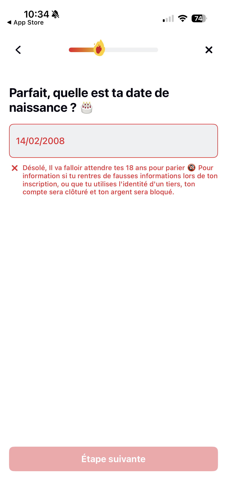
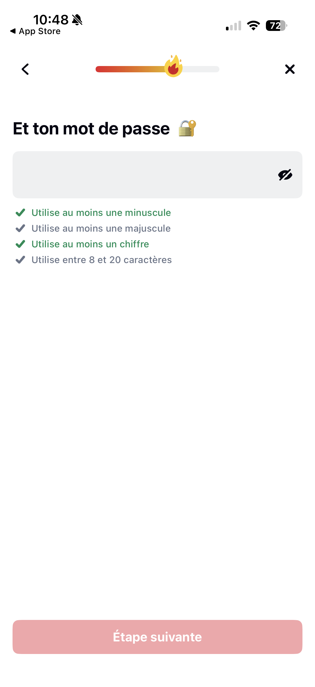

# Betclic – QA Assessment

## Part 1: Flow Analysis & UI Review

---

# 1. Environment

| Device            | OS         | App Version    |
| ----------------- | ---------- | -------------- |
| iPhone 16 Pro     | iOS 26.3   | Betclic 9.10.1 |
| Samsung Galaxy S9 | Android 10 | Betclic 9.10.1 |

- **Scope:** Account registration / onboarding flow (app launch → referral code step)
- **Primary test device:** Both devices — happy path verified on iOS and Android
- **Test limitations:** National ID upload and address verification intentionally skipped as instructed

---

# 2. Flow Map (Happy Path)

```
App Launch
→ Cookie Consent
→ iOS Tracking Permission (system-level)
→ Start Registration
→ Title Selection
→ First Name
→ Last Name
→ Date of Birth
→ Place of Birth (Country + City)
→ ID Document (Skipped)
→ Username
→ Password
→ Email
→ Phone Number
→ Address (Autocomplete + Confirmation)
→ Address Verification (Skipped)
→ Final Compliance Step (Age + T&C + Marketing + Referral Code)
```

---

# 3. Main Happy Path Description

### Step 1 – App Launch

User opens the Betclic mobile application and lands on the splash screen.

### Step 2 – Cookie Consent

A cookie consent modal is displayed with three options:

- Configure
- Accept all
- Continue without accepting

The user selects an option and proceeds.

### Step 2bis – iOS Tracking Permission (iOS Only)

An iOS App Tracking Transparency (ATT) system popup appears.  
This is an OS-level permission request, not part of Betclic’s UI.

The user can:

- Allow tracking
- Ask the app not to track

Regardless of the selection, the registration flow continues.

### Step 3 – Start Registration

User initiates the account creation process.

### Step 4 – Title Selection

User selects a civil status (e.g., Monsieur).

### Step 5 – First Name

User enters first name (as per official ID).

### Step 6 – Last Name

User enters last name.

### Step 7 – Date of Birth

User enters a valid birth date (18+).

### Step 8 – Place of Birth

User selects:

- Country of birth
- City (autocomplete field)

### Step 9 – ID Document

User is prompted to upload an identity document.  
As instructed, this step is skipped using “Do it later”.

### Step 10 – Username

User chooses an available username.

### Step 11 – Password

User enters a password meeting validation rules:

- At least 1 lowercase letter
- At least 1 uppercase letter
- At least 1 number
- Between 8 and 20 characters

Real-time validation feedback is displayed.

### Step 12 – Email

User enters a valid email address.

### Step 13 – Phone Number

User enters a valid mobile phone number.

### Step 14 – Address

User enters a street address.  
Autocomplete suggestions appear.  
User selects a valid address.

### Step 15 – Address Verification

User is prompted to:

- Upload proof of address  
  OR
- Receive a postal verification code

This step is skipped as instructed.

### Step 16 – Final Compliance & Referral Screen

User must:

- Certify being over 18 years old
- Accept Terms & Conditions

Optional:

- Accept marketing communications
- Enter referral / promo code

The account creation button becomes enabled once mandatory toggles are activated.

---

# 4. Alternative Branches Identified

## Alternative Branch 1 – Under 18 Date of Birth (Compliance Critical Path)

**What was tested:** Date of birth validation and legal age gating.

**How to reproduce (based on executed test):**

1. Start the registration flow.
2. Complete First Name and Last Name steps with valid data.
3. On the "Date of Birth" screen, enter a DOB that makes the user under 18 (e.g., `13/02/2008`).

**Actual result:**

- The date field is highlighted in red.
- A blocking error message is displayed stating that the user must wait until 18 years old to bet.
- Additional compliance warning indicates that providing false information or using a third party's identity may lead to account closure and funds being blocked.
- "Étape suivante" (Next step) button remains disabled.

**Evidence (Screenshots):**

| iOS                                                                            | Android                                                                                |
| ------------------------------------------------------------------------------ | -------------------------------------------------------------------------------------- |
|  |  |

**Expected result:**

- User must be strictly blocked from proceeding if under 18.
- Error messaging must be clear, legally compliant, and unambiguous.
- The blocking behavior must be consistent across devices and time zones.

**Boundary testing recommended (critical in gambling context):**

- Exactly 18 years old today → should be allowed.
- 18 years old minus 1 day → should be blocked.
- Clearly underage (e.g., 17 years old) → blocked.
- Senior age (e.g., 70+ years old) → allowed.
- Invalid dates (e.g., `31/02/2000`, `00/00/2000`, alphabetic input) → blocked with proper validation feedback.

---

**Boundary Test Results:**

| Test case                          | Expected                                                 | iOS Result                                                       | Android Result                                                           | Status |
| ---------------------------------- | -------------------------------------------------------- | ---------------------------------------------------------------- | ------------------------------------------------------------------------ | ------ |
| Under 18 (e.g., 13/02/2008)        | Block user + show regulatory message + disable next step | Blocked with red field + compliance warning + next step disabled | Blocked with same behavior — red field, compliance warning, CTA disabled | ✅ OK  |
| Exactly 18 years old today         | Allow user to proceed                                    | Allowed to proceed                                               | Allowed to proceed — same as iOS                                         | ✅ OK  |
| 18 years old minus 1 day           | Block user                                               | Blocked correctly                                                | Blocked correctly — same as iOS                                          | ✅ OK  |
| Senior age (70–120 years old)      | Allow user to proceed                                    | Allowed to proceed (tested up to 120 years old)                  | Allowed to proceed (tested up to 120 years old)                          | ✅ OK  |
| Invalid format (non-numeric input) | Block user with format validation                        | Only numeric input allowed (iOS keyboard restriction)            | Only numeric keyboard displayed — non-numeric input prevented            | ✅ OK  |
| 29/02 valid leap year              | Allow user to proceed                                    | Accepted on valid leap year                                      | Accepted on valid leap year — same as iOS                                | ✅ OK  |
| 29/02 non-leap year                | Block user                                               | Correctly blocked                                                | Correctly blocked — same as iOS                                          | ✅ OK  |

---

**QA Perspective:**
Age validation is a compliance-critical control in a regulated gambling environment. The age boundary logic must be precise (no off-by-one errors), robust against manual input manipulation, and aligned with legal requirements.

---

## Alternative Branch 2 – Invalid Password (Security & Validation Path)

**What was tested:** Password field validation rules and real-time feedback behavior.

**How to reproduce (based on executed test):**

1. Start the registration flow and proceed to the "Password" screen.
2. Enter passwords that violate one or more of the validation rules:
   - At least 1 lowercase letter
   - At least 1 uppercase letter
   - At least 1 number
   - Between 8 and 20 characters

**Actual result:**

- Real-time validation checklist is displayed below the password field.
- Each rule is visually updated as the user types (valid = green check, invalid = red/grey).
- The "Étape suivante" (Next step) button remains disabled until all rules are satisfied.
- No submission is possible with an invalid password.

**Evidence (Screenshots):**

| iOS                                                                                  | Android                                                                                      |
| ------------------------------------------------------------------------------------ | -------------------------------------------------------------------------------------------- |
|  |  |

> **Note:** iOS security policy hides password field content in screenshots. The password input is not visible in the iOS screenshot, but the validation checklist feedback is still visible and was verified during manual testing.

**Expected result:**

- User must not be able to proceed with a password that fails any validation rule.
- Real-time feedback must clearly indicate which rules are met and which are not.
- The CTA button must remain disabled until all criteria are satisfied.

**Validation rules tested:**

- At least 1 lowercase letter
- At least 1 uppercase letter
- At least 1 number
- Between 8 and 20 characters

---

**Boundary Test Results:**

| Test case                                  | Expected                                       | iOS Result                                         | Android Result                 | Status |
| ------------------------------------------ | ---------------------------------------------- | -------------------------------------------------- | ------------------------------ | ------ |
| Only lowercase (e.g., `abcdefgh`)          | Block — missing uppercase + number             | Blocked — 2 rules marked invalid, CTA disabled     | Blocked — same behavior as iOS | ✅ OK  |
| Only uppercase (e.g., `ABCDEFGH`)          | Block — missing lowercase + number             | Blocked — 2 rules marked invalid, CTA disabled     | Blocked — same behavior as iOS | ✅ OK  |
| Only numbers (e.g., `12345678`)            | Block — missing lowercase + uppercase          | Blocked — 2 rules marked invalid, CTA disabled     | Blocked — same behavior as iOS | ✅ OK  |
| 7 characters (e.g., `Abcde1!`)             | Block — too short                              | Blocked — length rule marked invalid, CTA disabled | Blocked — same behavior as iOS | ✅ OK  |
| 8 characters valid (e.g., `Abcdef1!`)      | Allow — meets all rules                        | Allowed — all rules green, CTA enabled             | Allowed — same behavior as iOS | ✅ OK  |
| 20 characters valid                        | Allow — meets all rules                        | Allowed — all rules green, CTA enabled             | Allowed — same behavior as iOS | ✅ OK  |
| 21 characters                              | Block — too long                               | Blocked — length rule marked invalid, CTA disabled | Blocked — same behavior as iOS | ✅ OK  |
| Special characters only (e.g., `!@#$%^&*`) | Block — missing lowercase + uppercase + number | Blocked — 3 rules marked invalid, CTA disabled     | Blocked — same behavior as iOS | ✅ OK  |
| Valid password (e.g., `Test1234`)          | Allow — meets all rules                        | Allowed — all rules green, CTA enabled             | Allowed — same behavior as iOS | ✅ OK  |
| Empty field                                | Block — all rules invalid                      | Blocked — all rules marked invalid, CTA disabled   | Blocked — same behavior as iOS | ✅ OK  |
| Password matches username                  | Block — password must differ from username     | Blocked — error displayed: "Ton mot de passe doit être différent de ton pseudo", CTA disabled | Blocked — same behavior as iOS | ✅ OK  |

> **Note:** When the password matches the username, the entire validation checklist disappears and is replaced by a single error message: "Ton mot de passe doit être différent de ton pseudo". The standard rules (lowercase, uppercase, number, length) are no longer visible. This means the user loses all feedback on the other validation criteria while this error is active.

---

**⚠️ Security Observation — Password persisted locally after app kill:**
During testing, it was observed that all registration data — including the password — is persisted locally when the app is killed mid-registration. Upon reopening the app, the password field is pre-filled and can be revealed in clear text via the visibility toggle (eye icon). While the account does not yet exist, this exposes the user's password pattern (generic passwords, prefix-based construction) to anyone with physical access to the device. This could help compromise the user's other accounts. **Sensitive fields like passwords should be cleared on app termination or session expiry**, even if other form fields are retained for convenience. Severity: **High**.

**UX Observation — No password confirmation field:**
The registration flow does not include a password confirmation field. On mobile, typos are common due to smaller keyboards and autocorrect behavior. A user who mistypes their password during registration will only discover the error at their next login attempt, forcing them through a password reset flow. Adding a confirmation field would prevent this friction at minimal cost.

**QA Perspective:**
Password validation is a core security control. Real-time feedback improves UX by guiding the user, but the enforcement must be strict — no bypass should be possible regardless of input method. Note: the app does not appear to enforce special character requirements or check against common/breached passwords, which could be a security improvement opportunity. Additionally, when the password matches the username, the validation checklist is entirely replaced by a single error message — the user loses visibility on all other password rules, which is a UX inconsistency.

---
